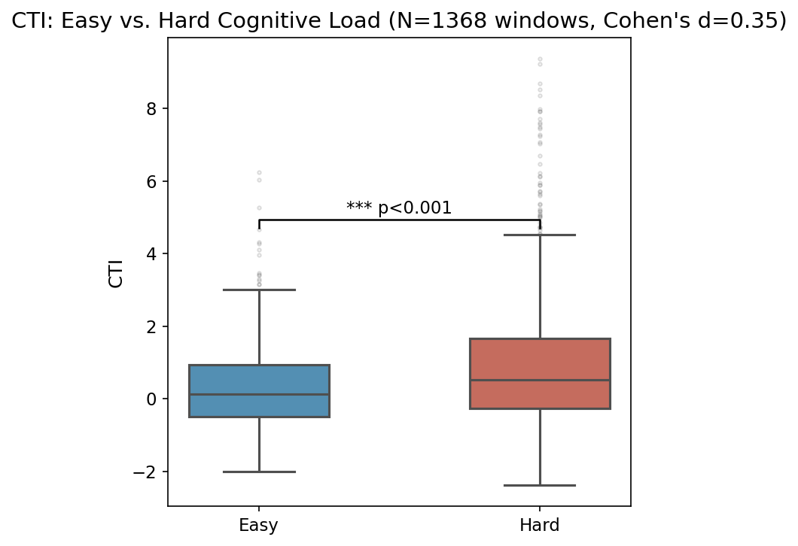
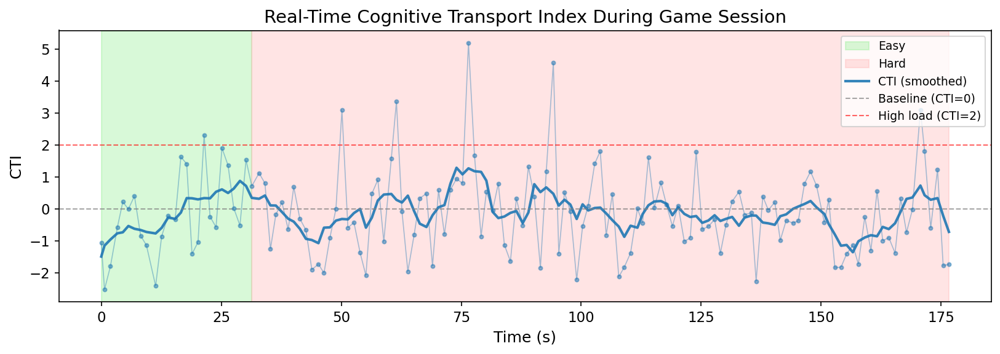

# Cognitive Transport Index (CTI)

**A label-free, real-time EEG cognitive load measure from the Schrödinger Bridge Problem.**

[](requirements.txt)
[](requirements.txt)

> **Repository:** [github.com/Vaibhav100968/Cognitive-Transport-Index](https://github.com/Vaibhav100968/Cognitive-Transport-Index)

---

## Overview

The **Cognitive Transport Index (CTI)** is a scalar measure of cognitive effort derived from the [Schrödinger Bridge Problem (SBP)](https://arxiv.org/abs/2304.00917): the minimum-entropy-production stochastic transport between a participant's resting-state EEG distribution and the current brain state. CTI is normalized against a participant-specific easy-task baseline, yielding a zero-centered signal that requires **no task labels at inference time**.

This repository contains the full implementation: offline SBP estimation, a streaming MQTT pipeline for live Emotiv EPOC X headsets, twelve baseline comparisons, analysis scripts, and a Moral Machine neuroadaptive game interface.

### Key results (VEGS dataset)

| Metric | Value |
|---|---|
| Easy vs. hard separation | Mann–Whitney *p* < 0.001, Cohen's *d* = 0.35 |
| CTI AUC (label-free) | **0.613** (easy: 0.39 ± 1.30, hard: 0.93 ± 1.74) |
| Best supervised baseline | LDA AUC 0.706 |
| Median streaming latency | **512.9 ms** (9× faster than mean reaction time) |

CTI outperforms all four classical neuroscience indices (Engagement, Spectral Band Ratio, Differential Entropy, RMS) and SVM/HMM supervised baselines, while operating in real time on consumer hardware without a GPU.

<p align="center">
  
  &nbsp;
  
</p>

---

## How it works


1. **Calibration** — 60 s resting-state EEG builds the reference distribution *P₀* and per-feature normalization stats.
2. **SBP estimation** — For each sliding window (*n* = 50 features, step = 10), forward/backward score networks are trained and the optimal bridge trajectory is sampled.
3. **Transport energy** — Mean squared displacement along the bridge quantifies how far the brain has departed from rest.
4. **CTI** — `(E − μ_easy) / σ_easy` yields a zero-centered, interpretable effort signal.

---

## Repository structure

```
Cognitive-Transport-Index/
├── core/
│   ├── SBP.py              # Score network, training, Euler–Maruyama sampling
│   ├── streaming_sbp.py    # StreamingSBP + offline validation
│   └── baselines.py        # 12 baseline models + AUC comparison
├── pipeline/
│   ├── cortex_client.py    # Emotiv Cortex → MQTT feature publisher
│   ├── sbp_subscriber.py   # MQTT → CTI inference server
│   ├── data_logger.py      # Session CSV logger
│   ├── live_dashboard.py   # Real-time CTI matplotlib dashboard
│   └── mock_eeg.py         # CSV replay for testing without hardware
├── analysis/
│   └── experiments.py      # Paper figures → analysis/figures/
├── benchmarks/
│   └── run_synthetic_benchmark.py  # Smoke benchmark (no real EEG)
├── tests/                  # Unit tests (pytest)
├── docs/
│   └── ARCHITECTURE.md     # System design + SBP/CTI notes
├── samples/outputs/        # Checked-in sample benchmark report
├── mt_moral_machine/       # Next.js Moral Machine game (MQTT events)
├── run_session.py          # Orchestrates subscriber + logger + dashboard
├── preprocess.py           # VEGS Excel → feature CSV (requires raw data)
└── requirements.txt
```

Deeper design notes (MQTT topology, score network, CTI lifecycle): **[docs/ARCHITECTURE.md](docs/ARCHITECTURE.md)**.

---

## Installation

```bash
git clone https://github.com/Vaibhav100968/Cognitive-Transport-Index.git
cd Cognitive-Transport-Index

python3 -m venv .venv
source .venv/bin/activate
pip install -r requirements.txt
```

**MQTT broker** (macOS / Homebrew):

```bash
brew install mosquitto
brew services start mosquitto
```

---

## Tests & synthetic benchmark

No subject EEG is required. Unit tests cover classical baselines, `ScoreNet`, and StreamingSBP / CTI math. The synthetic benchmark writes a sample report under `samples/outputs/`.

```bash
pytest -q
python benchmarks/run_synthetic_benchmark.py
# Optional: also train short score nets on synthetic clouds
python benchmarks/run_synthetic_benchmark.py --with-sbp
```

See the checked-in sample: [`samples/outputs/synthetic_benchmark.md`](samples/outputs/synthetic_benchmark.md).

---

## Usage

### Live session (Emotiv EPOC X)

```bash
# Terminal 1 — start inference pipeline
python run_session.py --participants player_1

# Terminal 2 — connect headset via Cortex API
python pipeline/cortex_client.py \
  --client-id YOUR_CLIENT_ID \
  --client-secret YOUR_CLIENT_SECRET \
  --participant player_1
```

Session logs are written locally to `data/session_data.csv` (gitignored).

### Mock replay (no hardware)

Place the preprocessed VEGS feature file (`cleaned_vegs_data_baseline_z.csv`) in the repo root — see [Data availability](#data-availability) — then:

```bash
python run_session.py --mock --participants "Player 1"
```

### Offline validation & baselines

```bash
python core/streaming_sbp.py   # streaming vs. offline SBP correlation
python core/baselines.py       # 12-model AUC comparison
python analysis/experiments.py # regenerate paper figures
```

Figures are saved to `analysis/figures/`.

---

## MQTT topics

| Topic | Direction | Payload |
|---|---|---|
| `eeg/features/{pid}` | Input | 8 band-power features + timestamp |
| `eeg/energy/{pid}` | Output | `raw_energy`, `CTI`, `phase`, `window_id`, `latency_ms` |
| `game/events/{pid}` | Input | Moral Machine scenario/choice events |

---

## Data availability

**Raw EEG recordings, preprocessed feature matrices, and session logs are not included in this repository.**

The VEGS dataset (10 participants, 16,904 windows, 256 Hz Emotiv EPOC X) and any derived artifacts used in the paper are **available upon request**. Contact the authors at [vaibhavgollapalli5@gmail.com](mailto:vaibhavgollapalli5@gmail.com).

To run mock replay or reproduce offline experiments locally, request:

- `cleaned_vegs_data_baseline_z.csv` — preprocessed band-power features
- `true_sbp_results.csv` — offline SBP ground truth (optional, for validation)

Place requested files in the repo root or `data/` as indicated by each script.

---

## Moral Machine game

The `mt_moral_machine/` directory contains a Next.js App Router interface for the MIT Moral Machine ethical decision-making paradigm, publishing game events over MQTT for synchronized CTI logging.

```bash
cd mt_moral_machine
npm install
npm run dev
```

---

## Citation

If you use this code or the CTI method, please cite:

```bibtex
@misc{gollapalli2026cti,
  title        = {The Cognitive Transport Index: A Comparative Analysis of Real-Time {EEG}
                  Cognitive Load Models via the Schr{\"o}dinger Bridge Problem},
  author       = {Gollapalli, Vaibhav and Sattiraju, Sriram and Pal, Aayush and McMahan, Timothy Fred},
  year         = {2026},
  howpublished = {Unpublished manuscript},
  url          = {https://github.com/Vaibhav100968/Cognitive-Transport-Index}
}
```

---

## Authors

| | Affiliation | Email |
|---|---|---|
| **Vaibhav Gollapalli** | Texas A&M University — Computer Science & Engineering | vaibhavgollapalli5@gmail.com |
| **Sriram Sattiraju** | University of Texas at Austin — Computer Science | srirams@cs.utexas.edu |
| **Aayush Pal** | University of North Texas — Learning Technologies | AayushPal@my.unt.edu |
| **Timothy Fred McMahan** | University of North Texas — Learning Technologies | Fred.McMahan@unt.edu |

---

## Ethical statement

This study uses the publicly available VEGS dataset. No new human subjects data were collected in this release. Passive cognitive load monitoring raises privacy considerations that must be addressed before deployment in sensitive contexts.

---

## License

Code is released for academic and research use. Contact the authors for commercial licensing inquiries.
